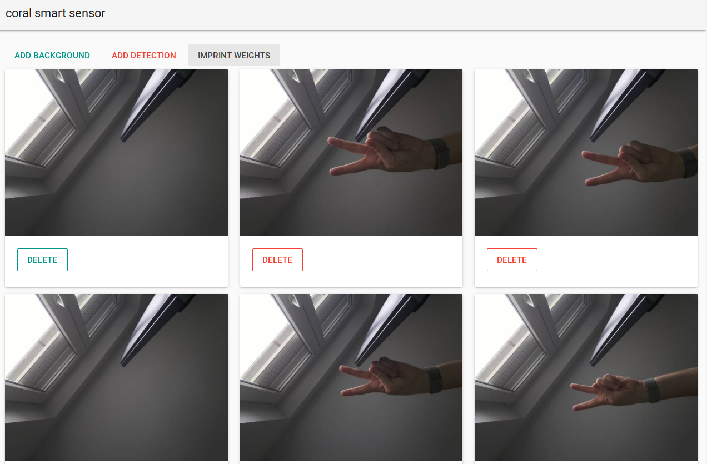

#Coral smart camera for Apple HomeKit
This project shows how to build a [Coral Edge TPU](https://coral.withgoogle.com/) trainable smart camera and integrate it into Apple HomeKit.
The project builds on [HAP-python](https://github.com/ikalchev/HAP-python) and consists of two main components: 

- A Web-GUI to train the camera. 
- A backend service to interact with HomeKit.

# Installation 
todo

# Usage 

## Download model weights 

Execute `download.sh` to download the pretrained embedding extractor. The extractor will be saved into the models directory.

## Start the Application 

To start the application you need to run both `run.py` and `hap.py`. 

# Imprint new weights

Access the application at `yourhost:5000/`. 
You can imprint new weights using the two buttons `add_background` and `add_detection`. Pressing on `imprint_weights` will update the classification model.

